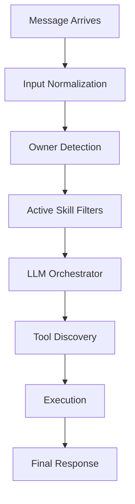

# Message Flow

Every message in Ubot follows a standardized lifecycle. This ensuring that triggers, filters, and safety guardrails are applied consistently across all channels.

### High-Level Flow

### Step 1: Normalization
Incoming data from Baileys (WhatsApp) or Telegraf (Telegram) is mapped to a unified `Message` interface. This includes sender ID, name, and timestamp.

### Step 2: Owner vs Visitor
Ubot checks if the sender's identifier matches the `owner` phone or username in `config.json`.
- **Owner**: Granted "Full" tool permissions.
- **Visitor**: Gated by "Visitor-Safe" tool restrictions and optional approval workflows.

### Step 3: Fast Filters (Skills)
Before reaching the LLM, Ubot executes "fast filters" (trigger/condition) defined in your Skills. If a skill matches, its instructions are prioritized in the LLM prompt.

### Step 4: The Orchestrator
The LLM analyzes the message.
- If it's a simple greeting, it responds conversationally.
- If it needs information (e.g., "What's on my calendar?"), it calls the relevant tool.
- If it's a sensitive action for a visitor (e.g., "Write a file"), it creates an **Approval Request**.

### Step 5: Post-Processing
The final generated response is sent back through the originating channel.
- If it's the web console, it appears in the logs.
- If it's a messaging app, the response is delivered as a message.
